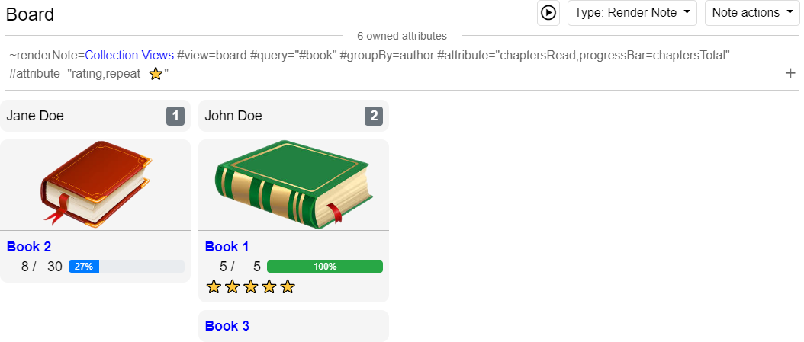
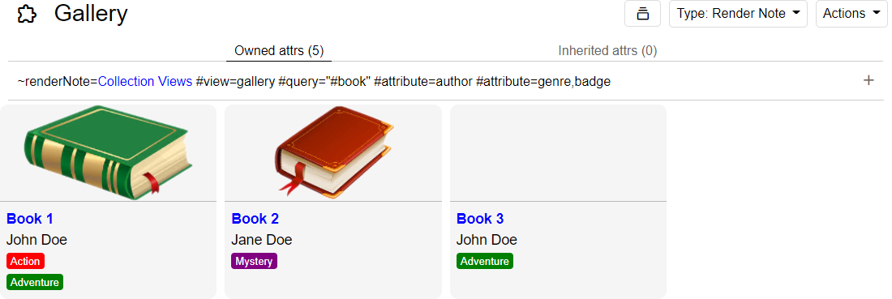
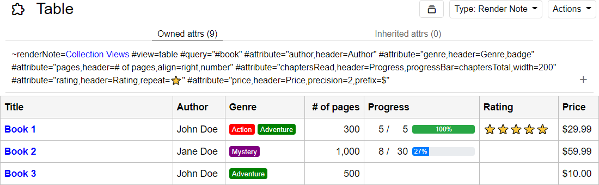
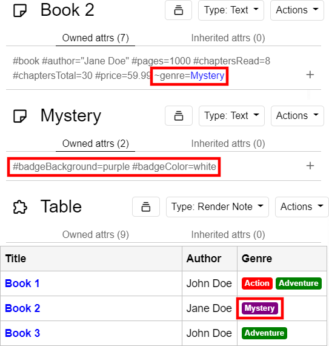

# Collection Views

An extension for [Trilium Notes](https://github.com/zadam/trilium) that implements different ways of viewing collections of notes.

- **Board view:** Displays notes in a Kanban board. Notes are grouped by some attribute and listed in columns.
- **Gallery view:** Displays notes in a grid.
- **Table view:** Displays notes in a table.

## Table of contents

- [Screenshots](#screenshots)
  - [Board view](#board-view)
  - [Gallery view](#gallery-view)
  - [Table view](#table-view)
- [Requirements](#requirements)
- [Installation](#installation)
- [Upgrading](#upgrading)
- [Usage](#usage)
- [Configuration](#configuration)
  - [Render Note attributes](#render-note-attributes)
    - [`view`](#view)
    - [`query`](#query)
    - [`groupBy`](#groupby)
    - [`sort`](#sort)
    - [`columns`](#columns)
    - [`columnWidth`](#columnwidth)
    - [`coverHeight`](#coverheight)
    - [`attribute`](#attribute)
  - [Attribute settings](#attribute-settings)
    - [`align`](#align)
    - [`badge`](#badge)
    - [`badgeBackground`](#badgebackground)
    - [`badgeColor`](#badgecolor)
    - [`boolean`](#boolean)
    - [`header`](#header)
    - [`number`](#number)
    - [`prefix`](#prefix)
    - [`precision`](#precision)
    - [`progressBar`](#progressbar)
    - [`repeat`](#repeat)
    - [`separator`](#separator)
    - [`suffix`](#suffix)
    - [`truncate`](#truncate)
    - [`width`](#width)
    - [`wrap`](#wrap)
    - [Escape sequences](#escape-sequences)
  - [Covers](#covers)
  - [Custom badge colors](#custom-badge-colors)
  - [Custom sorting](#custom-sorting)
  - [CSS variables](#css-variables)

## Screenshots

### Board view



### Gallery view



### Table view



## Requirements

Minimum Trilium version supported: v0.46

## Installation

1. Download `collection-views.zip` from the [Releases](https://github.com/mabeyj/trilium-collection-views/releases) page.

2. Import `collection-views.zip` into your tree: right-click a parent note, then select "Import into note".

3. Reload the frontend (Menu → Reload frontend).

## Upgrading

1. Download and extract `collection-views.zip` from the [Releases](https://github.com/mabeyj/trilium-collection-views/releases) page.

2. Replace the `css` and `js` child notes of the Collection Views note with the updated files found in the zip archive:

   - Select the `css` child note, click "Upload new revision", and select the `Collection Views/css.css` file that was extracted.
   - Select the `js` child note, click "Upload new revision", and select the `Collection Views/js.js` file that was extracted.

3. Reload the frontend (Menu → Reload frontend).

## Usage

1. Create a note that will render a view:

   - **Type:** Render Note
   - Add a `renderNote` relation targeting the Collection Views note.

2. Add a [`query` label](#query) to the Render Note with a [search query](https://github.com/zadam/trilium/wiki/Search) as its value. This will be executed by Trilium's search engine, and the resulting notes will be displayed in the view.

3. Optionally, add a [`view` label](#view) to the Render Note to select which type of view to use. By default, the table view will be used.

4. Optionally, [add labels](#configuration) to the Render Note to configure the view.

## Configuration

### Render Note attributes

Views are configured by adding labels to the Render Note.

#### `view`

- Optional (default: `table`)
- Single value

Selects which view to use. Possible values:

- `board`
- `gallery`
- `table`

Example: `#view=board`

#### `query`

- Required
- Single value

A [search query](https://github.com/zadam/trilium/wiki/Search) that will be executed using Trilium's search engine. The notes returned by this search are the notes that will be included in the view.

The substring `$title` will be replaced with the Render Note's title before executing the search.

Examples:

- `#query="#book #status=read"` would include all notes having a `book` label and a `status` label set to `read`.
- `#query="~parent.title=$title"` would include all notes having a `parent` relation targeting a note having the same title as the Render Note itself.

#### `groupBy`

- Board views only
- Required
- Single value

Determines the columns of the board view. The value of this label is an attribute name.

- If the attribute is a label, then notes are grouped by their values for that label.
- If the attribute is a relation, then notes are grouped by the notes targeted by the relation.

Columns are sorted by the specified attribute. [Custom sorting](#custom-sorting) is supported.

This attribute supports most [attribute settings](#Attribute-settings) for formatting the values displayed in column headers.

Examples:

- `#groupBy=status` would group notes by their values of the `status` label.
- `#groupBy=status,badge` would additionally format column headers as badges.

#### `sort`

- Optional
- Single value

Sorts notes in the view. The value of this label is a comma-separated list of attribute names. Attribute names can be prefixed with `!` to sort values in descending order.

- If an attribute is a label, then notes are sorted by their values for that label.
- If an attribute is a relation, then notes are sorted by the titles of notes targeted by the relation.

Values are sorted alphabetically and case-insensitively.

Notes are sorted by their titles last, and this is the default sort when no sorting is specified. [Custom sorting](#custom-sorting) is supported.

Example: `#sort="type,!price"` would sort notes by their `type` values first, then by `price` (in reverse order), then by their titles.

#### `columns`

- Gallery views only
- Optional (default: `4`)
- Single value

Sets the number of columns in a gallery view.

Example: `#columns=8`

#### `columnWidth`

- Board views only
- Optional (default: `250`)
- Single value

Sets the width of a board view's columns in pixels.

Example: `#columnWidth=100`

#### `coverHeight`

- Board and gallery views only
- Optional (default: `120`)
- Single value

Sets the height of card cover images in pixels. Setting this to `0` hides cover images.

Example: `#coverHeight=500`

#### `attribute`

- Optional
- Multiple values

Configures which note attributes will be displayed in the view and how they should be formatted.

- For board and gallery views, attributes appear underneath the cover image.
- For table views, attributes appear as additional columns in the table.

By default, attribute values will be shown as plain text. For labels, the label's value will be shown. For relations, the titles of target notes will be shown.

[Attribute settings](#Attribute-settings) control how the attribute values are formatted.

### Attribute settings

Labels that support attribute settings ([`#attribute`](#attribute) and [`#groupBy`](#groupBy)) have a value that is a comma-separated list. The first item in the list is an attribute name. Any remaining items in the list are settings (described below) either in the form of a flag (`settingName`) or a key/value pair (`settingName=value`).

#### `align`

- Table views only
- Optional (default: `left`)

Sets the text alignment of cells in the attribute's column. This can by any CSS `text-align` value such as `center` or `right`.

Example: `#attribute="price,align=right"`

#### `badge`

- Optional

Renders this attribute's value as a badge.

Badge colors can be customized in two ways:

- The [`badgeBackground`](#badgeBackground) and [`badgeColor`](#badgeColor) attribute settings.

- If this attribute is a relation, notes targeted by this relation can set the `badgeBackground` and `badgeColor` attributes. See [custom badge colors](#Custom-badge-colors).

Example: `#attribute="status,badge"`

#### `badgeBackground`

- Optional

Sets the background style of badges for this attribute. Any CSS `background` style can be set. If set, the [`badge`](#badge) setting is implicitly enabled.

If this attribute is a relation, notes targeted by this relation can set the `badgeBackground` attribute to override this style. See [custom badge colors](#Custom-badge-colors).

Example: `#attribute="status,badgeBackground=red"`

#### `badgeColor`

- Optional

Sets the font color of badges for this attribute. Any CSS color can be set. If set, the [`badge`](#badge) setting is implicitly enabled.

If this attribute is a relation, notes targeted by this relation can set the `badgeColor` attribute to override this style. See [custom badge colors](#Custom-badge-colors).

Example: `#attribute="status,badgeColor=black"`

#### `boolean`

- Not supported by [`groupBy`](#groupBy)
- Optional

Renders the attribute's value as a checkbox.

The checkbox will be checked unless the attribute's value is one of the following (case-insensitive):

- `f` or `false`
- `n` or `no`

If the attribute's value is empty, the checkbox will also be checked.

Example: `#attribute="done,boolean"`

#### `header`

- Table views only
- Optional (default: the attribute's name)

Sets the text displayed in the header cell of the attribute's column.

Examples:

- `#attribute="price,header=Price (in dollars)"`
- `#attribute="status,header="` will display an empty header cell.

#### `number`

- Optional

Formats the attribute's value as a number (inserting thousands separators).

Example: `#attribute="price,number"`

#### `prefix`

- Optional

Adds a string in front of the attribute's value.

Examples:

- `#attribute="price,prefix=$"`
- `#attribute="total,prefix=Total: "`

#### `precision`

- Optional (default: up to 3 digits)

Sets the number of digits displayed after the decimal point when the attribute's value is formatted as a number. If set, the [`number`](#number) setting is implicitly enabled.

Example: `#attribute="price,precision=2"`

#### `progressBar`

- Not supported by [`groupBy`](#groupBy)
- Optional

Renders a progress bar using the attribute's value as the numerator and another attribute's value (named by this setting's value) as the denominator. Both attributes must be labels with numeric values.

Example: `#attribute="completed,progressBar=total"`

#### `repeat`

- Optional

Renders the value as a string repeated depending on the attribute's numeric value.

Example: `#attribute="rating,repeat=⭐"`

#### `separator`

- Not supported by [`progressBar`](#progressBar)
- Optional (default: `space` for `boolean` and `badge` attributes, `comma` otherwise)

Sets the string inserted between values when an attribute has multiple values. This can be one of the following values:

- `newline`: Inserts a newline between values, resulting in one value per line.
- `comma`: Inserts a comma and space (`, `) between values.
- `space`: Inserts a space (` `) between values.

Or, it can be a custom separator. If this setting is not set to one of the above values, then the setting's value will be inserted as is between values.

Examples:

- `#attribute=description,separator=newline`
- `#attribute=author,separator=comma`
- `#attribute=tag,separator= | `

#### `suffix`

- Optional

Adds a string behind the attribute's value.

Examples:

- `#attribute="weight,suffix=kg"`
- `#attribute="price,suffix= CAD"`

#### `truncate`

- Table views only
- Optional (default: text is not truncated)

Truncates long text to some number of lines. If set as a flag, text is truncated to a single line. Otherwise, the setting's value specifies how many lines. If set, the [`wrap`](#wrap) setting is implicitly enabled.

Examples:

- `#attribute="description,truncate"` (truncate to single line)
- `#attribute="description,truncate=3"` (truncate to three lines)

#### `width`

- Table views only
- Optional (default: `300` for note title, `0` for attributes)

Sets the minimum width (in pixels) of the attribute's column. Columns may be resized proportionally since tables are set to 100% width.

Example: `#attribute=status,width=100`

#### `wrap`

- Table views only
- Optional (default: text does not wrap)

Toggles text wrapping. If enabled, long text in a column will wrap to multiple lines. For tables that scroll horizontally, setting a [`width`](#width) will avoid text getting squashed into a very thin column.

Example: `#attribute=description,wrap`

#### Escape sequences

Escape sequences in setting values begin with a backtick (<code>`</code>). The following escape sequences are supported:

- <code>``</code>: Backtick
- <code>`,</code>: Comma

Since settings are separated by a comma, the most common use for escape sequences is for escaping a comma so that it can be used literally in a setting that accepts arbitrary text.

Example: <code>#attribute=position,header=X`,Y</code> would display a header containing the text "X,Y".

### Covers

The board and gallery views display an optional cover image for each note. The first image found in the note's contents is used as the cover.

### Custom badge colors

When an attribute is a relation, its badge colors can be customized by adding certain labels to the note targeted by the relation:

- `badgeBackground` can be any CSS `background` value, such as colors or gradients, to set the badge's background style.

- `badgeColor` can be any CSS `color` value to set the badge's font color.



### Custom sorting

Custom sorting is achieved by defining a `sortableTitle` label on a note. When notes are sorted by their titles, their `sortableTitle` is used for comparison if it is defined, otherwise their actual title is used.

This is useful in a couple ways:

- Ignoring leading articles like "The", "A", or "An". For example, a note titled "The Example" with `#sortableTitle=Example` would appear under E instead of T.

- Numeric sorting. Alphanumerically, "Note 10" would be sorted before "Note 2". If you set `#sortableTitle="Note 02"` on Note 2, then it will appear in numeric order above Note 10.

### CSS variables

The following variables can be changed by [themes](https://github.com/zadam/trilium/wiki/Themes#custom-css-themes) or [custom CSS](https://github.com/zadam/trilium/wiki/Themes#custom-css):

```css
body {
  --collection-view-margin: 10px;
  --collection-view-table-border-color: #bfbfbf;
}
```

| Name                                   | Description                              |
| -------------------------------------- | ---------------------------------------- |
| `--collection-view-margin`             | Outermost `margin` applied to all views. |
| `--collection-view-table-border-color` | Table `border-color` for table views.    |
